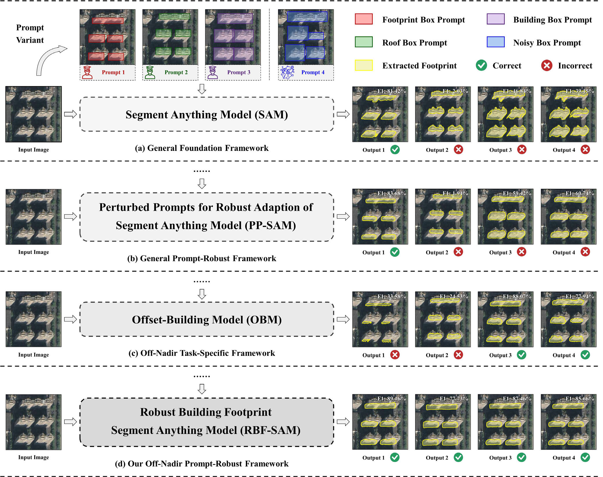
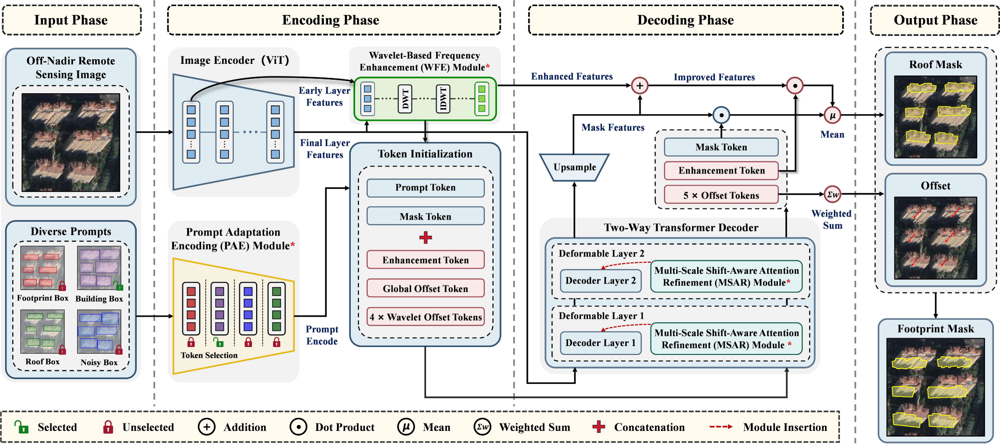

# RBF-SAM: Robust Building Footprint Extraction From Off-Nadir Remote Sensing Images via Segment Anything Model

> **Yuxuan Li, Keming Chen, Zicheng Lei, Yating Yang, Jinsong Lv, and Zhi Zhou**

The code in this toolbox implements the "[RBF-SAM: Robust Building Footprint Extraction From Off-Nadir Remote Sensing Images via Segment Anything Model](https://doi.org/10.1109/TGRS.2026.3709903)".

<div align="center">
  
  <p><em>The motivation of our work: The prompt sensitivity of SAM-based methods for off-nadir building footprint extraction</em></p>
</div>
<br>

<div align="center">
  
  <p><em>The architecture of the proposed RBF-SAM</em></p>
</div>

## Built With

Our work is based on the following excellent open-source projects:

•&nbsp;<a href="https://pytorch.org/"></a>&nbsp;&nbsp;&nbsp;&nbsp;&nbsp;•&nbsp;<a href="https://github.com/open-mmlab/mmdetection"></a>&nbsp;&nbsp;&nbsp;&nbsp;&nbsp;•&nbsp;<a href="https://github.com/facebookresearch/segment-anything"></a>&nbsp;&nbsp;&nbsp;&nbsp;&nbsp;•&nbsp;<a href="https://github.com/likaiucas/OBM"></a>


## Installation

**NOTE:** Please follow the installation of [OBM](https://github.com/likaiucas/OBM).

Our basic experimental environment: `PyTorch 1.13.1, CUDA 11.6, MMDetection 2.3.0`  

Please refer to the `requirements.txt` file for the running environment of this code.


## Data Preparation

* **The BONAI Dataset**: Please refer to the official link [jwwangchn/BONAI](https://github.com/jwwangchn/BONAI).
* **The OmniCity-view3 Dataset**: Please refer to the official link [opendatalab/MLS-BRN](https://github.com/opendatalab/MLS-BRN.git).
* **The Huizhou Test Set**: Please refer to the official link [likaiucas/OBM](https://github.com/likaiucas/OBM).


## Model Checkpoints

Coming soon.


## Train & Test

Coming soon.

## Citation

**Please kindly cite the papers if this code is useful and helpful for your research.**

Y. Li, K. Chen, Z. Lei, Y. Yang, J. Lv and Z. Zhou, "RBF-SAM: Robust Building Footprint Extraction From Off-Nadir Remote Sensing Images via Segment Anything Model," in IEEE Transactions on Geoscience and Remote Sensing, vol. 64, pp. 5631416-5631416, 2026, Art no. 5631416, doi: 10.1109/TGRS.2026.3709903.

```bibtex
@ARTICLE{11595002,
  author={Li, Yuxuan and Chen, Keming and Lei, Zicheng and Yang, Yating and Lv, Jinsong and Zhou, Zhi},
  journal={IEEE Transactions on Geoscience and Remote Sensing}, 
  title={RBF-SAM: Robust Building Footprint Extraction From Off-Nadir Remote Sensing Images via Segment Anything Model}, 
  year={2026},
  volume={64},
  number={},
  pages={5631416-5631416},
  keywords={Buildings;Modeling;Remote sensing;Modules (abstract algebra);Robustness;Conferences;Computers;Computer vision;Noise measurement;Grounding;Building footprint extraction;instance segmentation;model robustness;off-nadir remote sensing images;segment anything model (SAM)},
  doi={10.1109/TGRS.2026.3709903}
}
```

## Contact

**Yuxuan Li:** liyuxuan231@mails.ucas.ac.cn

Yuxuan Li is with the Aerospace Information Research Institute, Chinese Academy of Sciences, 100094 Beijing, China.

*Note: Since the codebase is built upon an earlier version of MMDetection and involves multiple file modifications, there might be some missing files or setup details. If you encounter any issues during implementation, please don't hesitate to reach out.*
